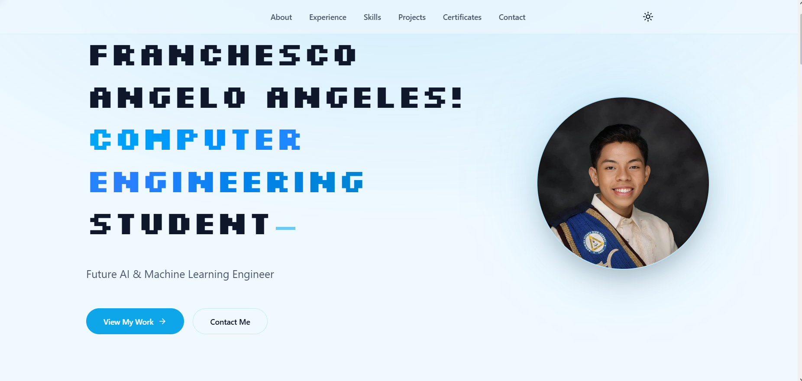

# 🚀 Franchesco Angelo's Portfolio

Welcome to the open-source repository for my personal portfolio website! This project is designed to showcase my journey as a **Future AI & Machine Learning Engineer** and full-stack software developer. 



## ✨ Key Features

This website is built with modern web development standards, focusing on high performance, smooth interactions, and a stunning aesthetic.

- **Framework**: [Next.js](https://nextjs.org) 
- **Styling**: [Tailwind CSS v4](https://tailwindcss.com/)
- **Animations**: [Framer Motion](https://www.framer.com/motion/) for fluid, dynamic micro-interactions and transitions
- **Smooth Scrolling**: [Lenis](https://lenis.studiofreight.com/) integration for a cinematic, physics-based scrolling experience
- **Theming**: Full Light and Dark mode support via `next-themes`
- **Typography**: Optimized loading of `Inter`, `Outfit`, and `Silkscreen` fonts via `next/font`

## 🛠️ Getting Started

To run this project locally on your machine, follow these steps:

1. **Clone the repository:**
   ```bash
   git clone https://github.com/frnchscoangelo18/my_portfolio.git
   cd my_portfolio
   ```

2. **Install dependencies:**
   ```bash
   npm install
   ```

3. **Run the development server:**
   ```bash
   npm run dev
   ```

4. **View the site:**
   Open [http://localhost:3000](http://localhost:3000) in your browser to see the portfolio in action!

## 📬 Let's Connect

I'm always open to discussing new opportunities, internships, or collaborating on interesting AI and software engineering projects!

- **LinkedIn**: [Franchesco Angelo Angeles](https://www.linkedin.com/in/franchescoangeloangeles18)
- **GitHub**: [@frnchscoangelo18](https://github.com/frnchscoangelo18)
- **Email**: [franchescoangelo1805@gmail.com](mailto:franchescoangelo1805@gmail.com)

---

> *"The best way to predict the future is to invent it." — Alan Kay*
